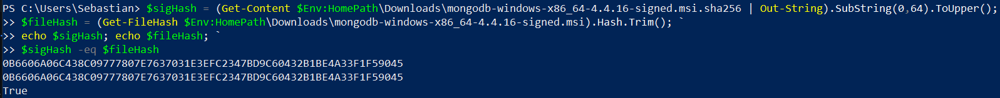
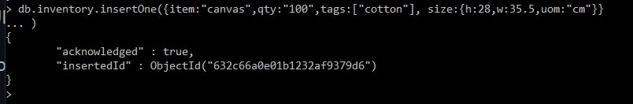
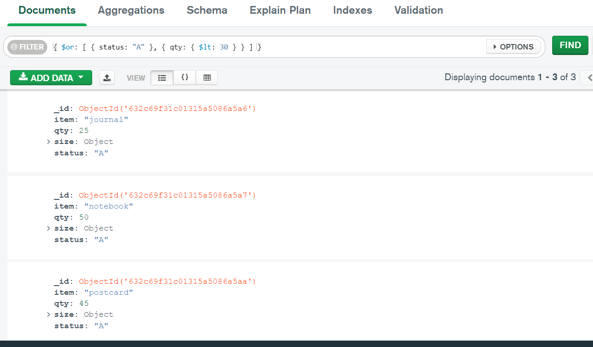
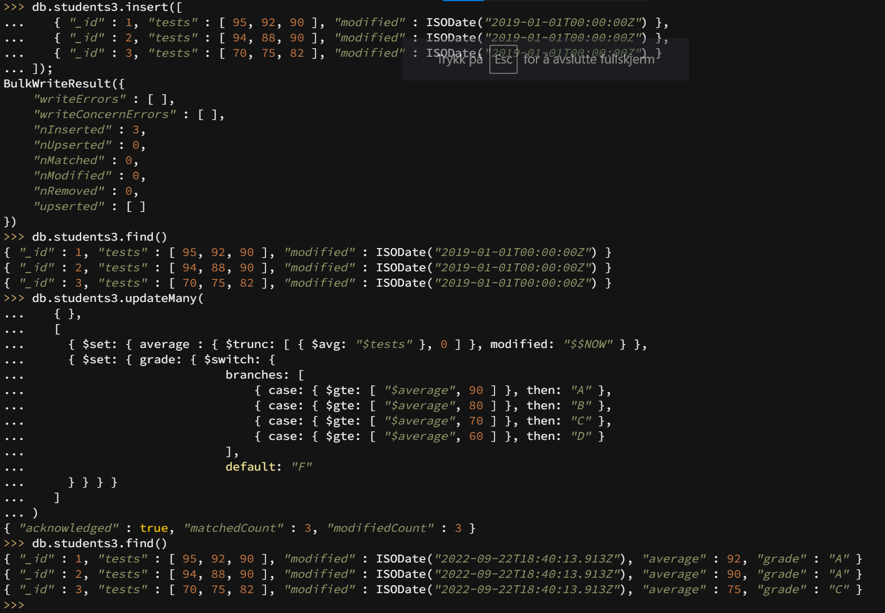
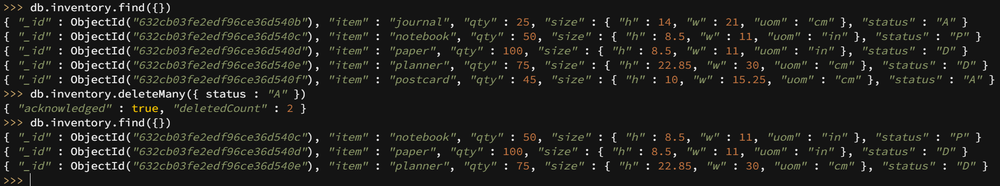
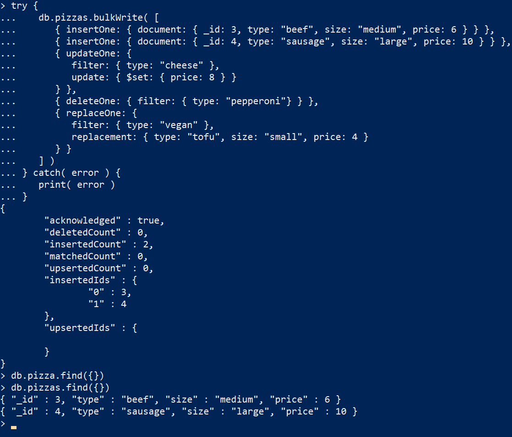
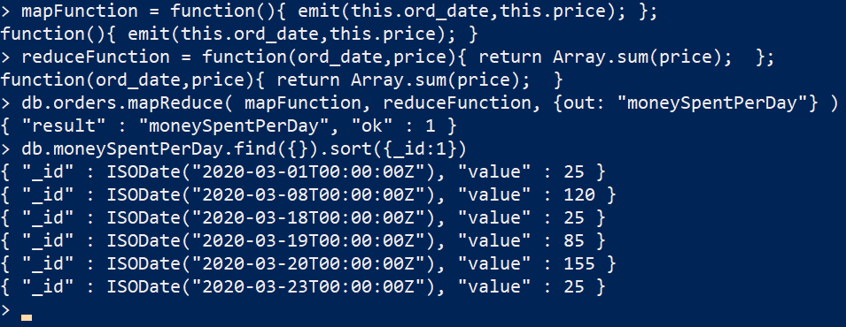

## Expass 3

### Technical problems
None

### Screenshots
#### Correct validation

#### Crud operations
##### Create

##### Read

##### Update

##### Delete

##### Bulk write

#### Map-Reduce
##### Example

##### Custom

This map-reduce operation shows how much money was spent per day, which is usefull since it is smart to have a overview over that.

### Pending issues
None
